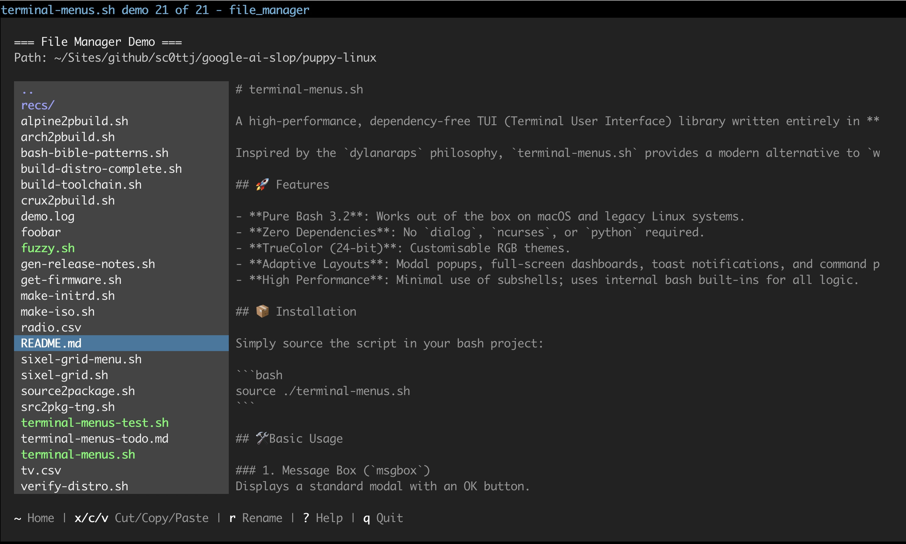
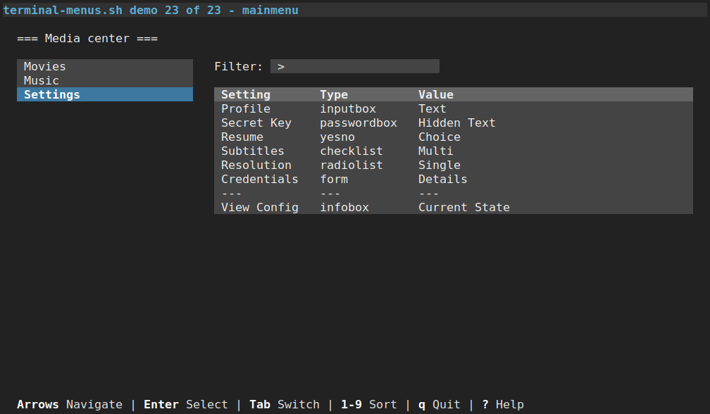

# terminal-menus.sh

A high-performance, dependency-free TUI (Terminal User Interface) library written entirely in **Pure Bash 3.2+**, with `whiptail` and `dialog` style widgets, and more modern, fancier ones too.

Inspired by the `dylanaraps` philosophy, `terminal-menus.sh` provides a modern alternative to `whiptail` and `dialog` with support for TrueColor and modular layouts.

See the demos :) 

## Screenshots

The `file_manager` in fullscreen mode:



The `mainmenu` in fullscreen mode:



## 🚀 Features

- **Pure Bash 3.2**: Works out of the box on macOS and legacy Linux systems.
- **Zero Dependencies**: No `dialog`, `ncurses`, or `python` required.
- **TrueColor (24-bit)**: Customisable RGB themes.
- **Adaptive Layouts**: Modal popups, full-screen dashboards, toast notifications, and command palettes.
- **High Performance**: Minimal use of subshells; uses internal bash built-ins for all logic.

## 📦 Installation

Simply source the script in your bash project:

```bash
source ./terminal-menus.sh
```

## 🛠 Basic Usage

### 1. Message Box (`msgbox`)
Displays a standard modal with an OK button.
```bash
OK_LABEL="Let's Go!"
msgbox "Welcome" "This is a standard message box.\nEnjoy!"
```

### 2. Info Box (`infobox`)
A non-blocking message window without buttons. Ideal for background tasks.
```bash
infobox "Processing" "I'm an infobox.\nI show messages without buttons."
sleep 2
```

### 3. Yes/No Menu (`yesno`)
Standard boolean choice. Includes support for default focus (1 for Yes, 2 for No).
```bash
if yesno "Question" "Do you want to continue?" 2; then
    echo "User chose Yes"
fi
```

### 4. Input Box (`inputbox`)
Captures a single line of text from the user.
```bash
USER_NAME=$(inputbox "Identity" "Enter your username:" "foo")
```

### 5. Password Box (`passwordbox`)
Masked input for sensitive tokens or passwords.
```bash
PASS=$(passwordbox "Security" "Enter a secret token:" "ppp")
```

### 6. Menu (`menu`)
A standard single-choice selection list.
```bash
CHOICE=$(menu "Simple Menu" "Pick a fruit:" 2 "Apple" "Banana" "Cherry")
```

### 7. Checklist (`checklist`)
Multiple-choice selection list.
```bash
CHKS=$(checklist "Checklist" "Select multiple options:" 2 "Option 1" "Option 2" "Option 3")
```

### 8. Radiolist (`radiolist`)
Mutually exclusive selection list.
```bash
RADIO=$(radiolist "Radiolist" "Choose exactly one:" 2 "Low" "Medium" "High")
```

### 9. Filtermenu (`filtermenu`)
A searchable, real-time filtered list for large datasets.
```bash
COUNTRIES="Argentina\nAustralia\nBrazil\nCanada"
SEARCH=$(filtermenu "Search" "Type to filter:" 1 "$COUNTRIES")
```

### 10. Gauge (`gauge`)
Visual progress bar tracking piped input (0-100).
```bash
( for i in {0..100..20}; do echo $i; sleep 0.3; done ) | gauge "Deploying" "Working..."
```

### 11. Textbox (`textbox`)
A read-only scrollable file viewer.
```bash
textbox "Source View" "./terminal-menus.sh"
```

### 12. Tailbox (`tailbox`)
Live-monitoring of a file (similar to `tail -f`).
```bash
tailbox "Log Monitor" "server.log"
```

### 13. Tree (`tree`)
Deep hierarchical navigation. Returns the ID of the selected node.
```bash
TREE_DATA=("0|usr|/usr|true" "1|bin|bin/|true" "2|bash|bash|false")
TREE_RES=$(tree "Browser" "Select path:" 1 "${TREE_DATA[@]}")
```

### 14. Configtree (`configtree`)
Hierarchical configuration toggle. Returns a list of variable assignments.
```bash
CONFIG_OUT=$(configtree "Settings" "Configure System" 1 "${CONFIG_DATA[@]}")
```

### 15. Form (`form`)
Advanced form builder. Returns shell-evaluable assignments.
```bash
FORM_OUT=$(form "Provisioning" "Node" "> User:user=guest" "[x] Wifi:wlan0" "(*) Prod:p")
eval "$FORM_OUT"
```

### 16. File Navigator (`file_navigator`)
A lightweight, fast keyboard-driven file picker.
```bash
FILE_PICK=$(file_navigator "Choose File" "." 1)
```

### 17. Table (`table`)
Navigable CSV data grid. Returns the 'Command' field of the selected row.
```bash
LAUNCH_CMD=$(table "Action Center" "data.csv" 1)
```

### 18. Filtertable (`filtertable`)
Searchable, real-time filtered CSV data grid.
```bash
RESULT_CMD=$(filtertable "Service Search" "services.csv" 1)
```

### 19. Main Menu (`mainmenu`)
Kodi-style split-pane orchestrator for navigating menus, tables, and launching commands and other widgets.
```bash
mainmenu "Media Center" "Select category" "$MENU_CFG" 1
```

### 20. File Manager (`file_manager`)
An `fff`-style full-featured file manager with search & filter, file previews, multiple select, command prompts, more.

```
Controls:

[Arrows]  Navigate
[ENTER]   Open / Select
[TAB]     Add to selection ({}/sel)
[.]       Toggle hidden files
[l]       Toggle detailed list
[/]       Search filter
[$/!]     Shell prompt (user/root)
[{}/sel]  Current selection in shell
[f/d]     New file or dir
[r]       Rename item
[x/c]     Toggle cut (x)/copy (c)
[v]       Paste
[j/k/J/K] Down/Up/PageDown/PageUp
[g/G]     Jump to top/bottom
[q/ESC]   Exit / Cancel
```

Usage:

```bash
file_manager "Home" "$HOME"
```

---

## 🖼 Advanced Features

### 🎨 Layout Modes (`TUI_MODE`)

The library uses a global `TUI_MODE` variable to determine the geometry and placement of widgets.
You can change this on the fly between widget calls to create dynamic interfaces.

#### Standard Layouts
- **`centered`** (Default): A balanced box (74x22) centered on the screen.
- **`fullscreen`**: Occupies the entire terminal area. Best for `file_manager` and `mainmenu`.
- **`classic`**: A standard 80x25 terminal box centered for a nostalgic feel.
- **`popup`**: A small (50x7) high-focus modal for quick alerts or single inputs.

#### Edge-Anchored Layouts
- **`top`**: A full-width bar (10 rows high) at the very top of the terminal.
- **`bottom`**: A full-width bar (10 rows high) snapped to the bottom edge.

#### Floating & HUD Layouts
- **`toast`**: A slim notification box (35x4) snapped to the **top-right** corner.
- **`palette`**: A versatile "Command Palette" that uses the `ANCHOR` variable for placement.

#### `ANCHOR` (For `palette` mode)
When using `palette`, set the `ANCHOR` environment variable to a two-letter code:
- **`tl` / `tr`**: Top-Left / Top-Right
- **`bl` / `br`**: Bottom-Left / Bottom-Right
- **`tc` / `bc`**: Top-Center / Bottom-Center
- **`cc`**: Dead Center

#### Examples

**A standard centered question:**
```bash
TUI_MODE="centered" yesno "Title" "Do you want to proceed?"
```

**A quick notification toast that disappears after 3 seconds:**
```bash
TUI_MODE="toast" infobox "System" "Backup completed successfully." && sleep 3
```

**A command palette anchored to the bottom-right:**
```bash
TUI_MODE="palette" ANCHOR="br" menu "Actions" "Rebuild" "Deploy" "Quit"
```

**A full-screen dashboard:**
```bash
TUI_MODE="fullscreen" BACKTITLE="Server Monitor" mainmenu "Dashboard" "Select Tool" "$MENU_CFG"
```

---

### 🎨 Theme Customisation & Live Reloading

The library uses a set of global variables for its TrueColor (24-bit RGB) palette. You can change these at any time to create custom themes or dark/light mode toggles.

#### Global Colour Variables
- `BG_MAIN`: The main background of the widget window.
- `BG_WIDGET`: The background for buttons, list items, and inputs.
- `BG_ACTIVE`: The primary focus/highlight colour (Deep Blue by default).
- `FG_TEXT`: The primary text colour.
- `FG_HINT`: Dimmed text for footer controls and shortcuts.
- `BG_INPUT`: Near-black background for text input fields.

#### Live Reloading a Theme
To change the theme on the fly, update the variables and then call `_init_tui`. This is useful for "Settings" menus that apply changes immediately without restarting the script.

```bash
# Define a 'Midnight' theme
set_midnight_theme() {
    BG_MAIN="10;20;30"      # Very dark blue
    BG_WIDGET="30;40;50"    # Muted blue-grey
    HL_BLUE="0;255;255"     # Cyan selection
    
    # Reload the TUI engine to apply changes
    _init_tui 
}

# Example: Change theme based on user choice
if yesno "Theme Switcher" "Switch to Midnight mode?"; then
    set_midnight_theme
fi
```

#### Mapping Highlights
The variable `HL_BLUE` is an alias for `BG_ACTIVE`. When you update one, the library automatically re-calculates the bold and inverted ANSI sequences during the next `_init_tui` call, ensuring all widgets (menus, checklists, etc.) stay visually consistent.

---

### 🖼 Modal Dialogs in Fullscreen
A key feature of this library is the ability to launch **Modal Widgets** on top of a "parent" fullscreen widget (like `mainmenu` or `file_manager`). This creates a layered, "desktop-like" experience without losing the state of the background application.

To achieve this, use the `modal` wrapper. This automatically handles background dimming, state preservation, and terminal cleanup.

#### Using the `modal` Wrapper
The `modal` function tells the library to "faint" the background and treat the next widget as a temporary overlay.

```bash
# Inside a script or a CSV command:
modal "yesno 'Playback' 'Resume from last seen?'"
```

This is most powerful when used in the `Command` column of your `table` or `mainmenu` CSVs:

```csv
Item,Category,Command
Settings,System,modal "form 'Settings' 'Edit User' '> User:u'"
Delete,Action,modal "yesno 'Confirm' 'Are you sure?'" && rm file.tmp
```

---

## ⚙️ Persistent Configuration

The `mainmenu` demo includes a `update_config` helper to manage `key=value` configuration files with automatic duplicate removal:

```bash
# Saves 'theme=dark' to your config file
update_config "theme='dark'"
```

## 📜 License

Copyright (c) 2026 sc0ttj
Licensed under the MIT License:  
[https://opensource.org](https://opensource.org)

